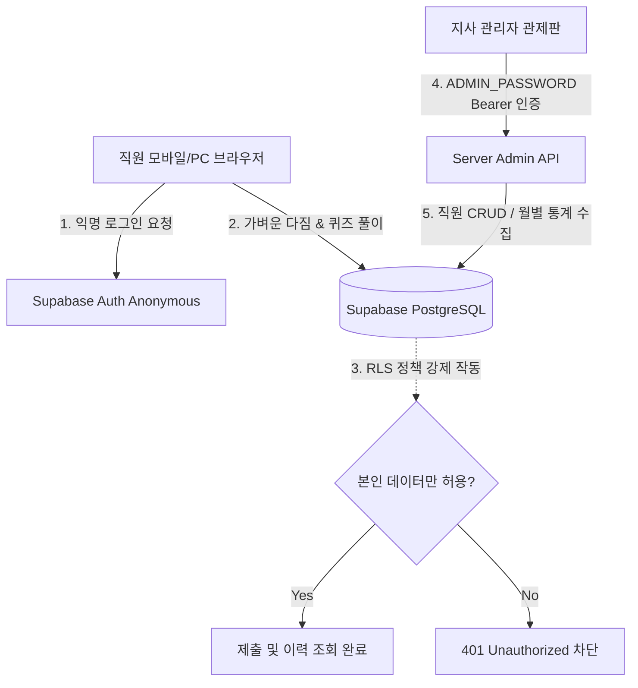

# 🌳 서울강동지사 청렴도 평가 향상 프로젝트: 청렴 바이브 MVP 보고서
> **소속:** 서울강동지사 청렴도 평가 향상 직원 참여형 테스크포스 (TF)  
> **목적:** 대외 공공기관 청렴도 평가 점수 도약 및 일상 속 청렴 문화 내재화  
> **핵심 키워드:** 참여형 웹앱, 청렴 나무 성장 시뮬레이션, 익명성 보장, 마이크로 학습

---

## 1. 프로젝트 개요 및 기획 배경

### 🚨 기존 청렴 교육의 Pain Point (핵심 한계점)
1. **일방향성 주입 교육의 피로감**
   - 기존의 서면 위주나 하향식 동영상 교육은 직원의 자발적인 동기부여를 이끌어내지 못하며 형식적인 참여에 그침.
2. **현업 업무와의 괴리감**
   - 구체적인 행동 기준이 아닌 법령이나 모호하고 추상적인 윤리 개념 위주로 전달되어 실제 업무 현장에서 적용하기 어려움.
3. **참여에 따른 체감 효과 결여**
   - 직원이 지사의 청렴도 향상을 위해 구체적으로 기여하고 있다는 체감이나 시각적인 성취 요소가 전무함.

### ✨ 청렴 바이브의 혁신적 해결방안
1. **초경량 모바일/웹 친화적 1분 참여 환경**
   - 복잡한 로그인이나 프로그램 설치 없이 스마트폰이나 PC 브라우저를 통해 단 1분 만에 가볍게 참여할 수 있는 최적의 UX 구현.
2. **일상 속 마이크로 다짐 및 퀴즈 습관화**
   - 매월 1일과 15일에 실천 가능한 3가지 다짐 문구를 서약하고, 최근 빈출 사례 중심의 퀴즈를 해결하면서 청렴 가치를 행동양식으로 자연스럽게 내재화.
3. **시각적 동기부여: '청렴 나무 성장 트래커'**
   - 본인이 실천을 약속하고 퀴즈를 풀수록 새싹이 점점 자라나 울창한 청렴 나무가 되는 모습을 비주얼 피드백으로 제공하여 소속감과 재미 유도.

---

## 2. MVP 핵심 기능 소개

### ① 오늘의 청렴 실천 체크 (Check-in)
* **내용:** 공공기관 청렴도 평가에서 자주 다루는 **6가지 핵심 윤리 영역**에서 추출된 해요체의 다짐 문구를 무작위로 추출하여 제공합니다.
* **영역 목록:** 
  1. 🏛️ 청렴 의무·직무윤리
  2. ⚖️ 이해충돌 방지
  3. 🎁 금품·향응·편의 금지
  4. 🚫 청탁·알선 금지
  5. 📋 공정성·투명성 제고
  6. 🔒 행동강령·비밀 유지
* **동작:** 서로 다른 영역에서 중복 없이 추출된 3개의 문구 중, 자신이 오늘 행동으로 옮길 항목을 선택해 가볍게 약속합니다.

### ② 사례형 청렴 마이크로 퀴즈 (Quiz)
* **내용:** 행동강령을 암기식으로 풀이하는 것이 아니라, 직무 현장에서 겪을 수 있는 교묘한 윤리 갈등 상황을 OX 및 객관식 문제(2문항)로 제시합니다.
* **동작:** 사용자가 답을 체크하는 즉시 판독 결과와 함께 알기 쉬운 구체적 해설(💡 행동강령 요약)을 제공하여, 올바른 직무수행 판단 기준을 인지적으로 훈련시킵니다.

### ③ 비주얼 청렴 나무 5단계 성장 트래커 (Growth Tracker)
누적 참여 횟수에 따라 사용자의 세션 캐릭터가 시각적으로 크게 진화합니다.

| 단계 | 이모지 | 명칭 | 기준 횟수 | 단계별 세부 설명 |
| :--- | :---: | :---: | :---: | :--- |
| **1단계** | 🫘 | **최초 씨앗** | `0회 이상` | 참여 이력이 없는 신규 유입 상태입니다. 최초 제출 시 껍질을 깨고 나옵니다. |
| **2단계** | 🌱 | **청렴 새싹** | `2회 이상` | 작은 실천의 습관을 기르기 시작해 흙 위로 귀여운 새싹이 돋아난 단계입니다. |
| **3단계** | 🌿 | **잎새 단계** | `4회 이상` | 이파리가 무성해지며 청렴이 행동 습관으로 자리 잡아가기 시작하는 단계입니다. |
| **4단계** | 🪴 | **성장 화분** | `8회 이상` | 줄기가 단단해지고 대가 굵어져 주변 동료에게 긍정적 영향력을 미치는 전파자 단계입니다. |
| **5단계** | 🌳 | **청렴 나무** | `14회 이상` | 지사 내 청렴 문화를 상징하는 거대한 나무가 완성되어 황금 열매를 맺은 최종 마스터 단계입니다. |

### ④ 관리자 관제 시스템 (Admin Dashboard)
* **기능 1 (직원 관리):** 지사 소속 임직원의 입사, 부서 이동, 퇴사 처리를 할 수 있는 CRUD 시스템 제공 및 테스트용 27명 일괄 임시 직원 자동 시딩(Upsert Seed) 기능 제공.
* **기능 2 (참여 지표 모니터링):** 월별/부서별 총 제출 횟수, 유일 참여 사용자 수, 기관 총원 대비 실시간 참여율 통계 데이터 대시보드 시각화.

---

## 3. 코드 아키텍처 및 폴더 설명 (비전문가용 요약)

* **📂 app (화면 및 API 라우트)**
  - 실제 웹 사이트 주소와 화면 구성을 결정하는 중심 폴더입니다.
  - `/admin`(관리자 전용 대시보드 화면), `/check`(다짐 체크인 페이지), `/quiz`(사례형 퀴즈 페이지)가 포함되어 있습니다.
  - `page.tsx`는 브라우저 첫 진입 시 Supabase 서버로부터 사용자의 참여 카운트를 실시간 조회해 성장 게이지와 매핑해 주는 대시보드 홈 화면입니다.
* **📂 components (화면 조각 컴포넌트)**
  - 화면에 나타나는 레고 블록 같은 구성 부품 폴더입니다.
  - `/check/CheckInSection.tsx`(다짐 토글 및 중복 제출 예방 제어), `/quiz/QuizSection.tsx`(퀴즈의 실시간 오답 판정 및 즉각 해설 렌더링), `/dashboard/SaplingGrowth.tsx`(참여 카운트에 따른 나무 성장 게이지 및 애니메이션) 등으로 세분화되어 결합되어 있습니다.
* **📂 lib (핵심 유틸리티 및 데이터 규칙)**
  - 비즈니스 룰과 데이터 연동 인터페이스가 보관된 도서관 역할입니다.
  - `lib/constants/` 폴더 안의 파일들(`checkPhrases.ts`, `quizBank.ts`, `integrityAxes.ts`)에는 청렴 6대 지표 점검 문구와 퀴즈 문제 은행 텍스트가 모두 통합 보관되어 있어, 차후 대외 지표가 변경되어도 화면 코드를 수정할 필요 없이 **이 데이터의 문구만 고쳐주면 전체 웹앱에 실시간 자동 갱신**됩니다.
  - `lib/dates/activeDays.ts`는 한국 표준시(KST)를 반영하여 당일이 매월 1일 또는 15일에 해당하는 제출일이 맞는지 강제 검증하는 보안 제한 장치입니다.
* **📂 supabase (데이터베이스 스키마 설계)**
  - 클라우드 데이터베이스의 물리적 구조를 정의한 SQL 설계 도면입니다. RLS 정책 강제화 룰이 내장되어 있습니다.

---

## 4. 시스템 설계 아키텍처 및 보안 체계

### 🔒 철저한 직원 익명성 보장
1. **임시 계정 발급 (Anonymous Auth):**
   - 사번이나 주민번호 같은 개인 신상정보를 요구하지 않고 브라우저 고유 세션 키 기반의 익명 인증을 적용하여 **"내 정보가 회사에 모니터링되고 있다"**는 거부감을 완전히 해소했습니다.
2. **테이블 수준 RLS (Row Level Security) 강제:**
   - 데이터베이스 정책을 수립하여 다른 사용자의 세션 정보가 무단으로 도청되거나 침투하는 것을 원천 차단하고 오직 본인의 누적 데이터만 조회할 수 있게 격리했습니다.
3. **관리자 이중 방벽:**
   - 임시 사원 CRUD 및 지사 전체 통계 수집 API는 서버 내부 환경변수에 설정된 비밀번호 검증 시스템(`ADMIN_PASSWORD`)을 통과하지 않으면 외부 비인가자가 원천적으로 접근하지 못하도록 안전장치를 적용했습니다.

---

## 5. 단계별 고도화 로드맵

### Phase 1 (현재 MVP 단계)
- 1일/15일 한국 표준시(KST) 연동 시간 제어 완료
- 무작위 청렴 실천 다짐 및 시나리오 퀴즈 즉시 해설 탑재
- Supabase RLS DB를 통한 개인 이력 비식별 보호 장치 가동
- 관리자용 직원CRUD 및 월 통계 패널 제공

### Phase 2 (차기 릴리즈 단계)
- 브라우저 쿠키 삭제 시 이력이 날아가는 문제를 보완하기 위해 **보안성이 한 단계 완화된 기관 메일 매직링크(Magic Link) 로그인**으로 전환
- 로그인 성공 시 본인의 고유 청렴 나무가 영구 보존되는 영속적인 성장 경험 고도화

### Phase 3 (전사 전파 및 평가 대비 단계)
- 부서별(경영지원팀, 기술지원팀, 검사팀 등) 실시간 참여율 데이터를 투명하게 공개하여 선의의 자율 경쟁 환경 구축
- 지사 로비 전광판에 실시간 부서별 '강동 청렴의 숲' 미디어 아트 시각화
- 공공기관 청렴도 평가 실사단 방문 시, 지사의 대표적인 혁신 자율 참여 우수 모범사례로 프리젠테이션 전시

---
> **보고서 배포 관리:** 서울강동지사 청렴도 평가 향상 직원 참여형 테스크포스 (TF)  
> 본 보고서와 연동 파일은 비공개 내부 검토 및 평가 심사 제출용으로만 유효합니다. 2026.
